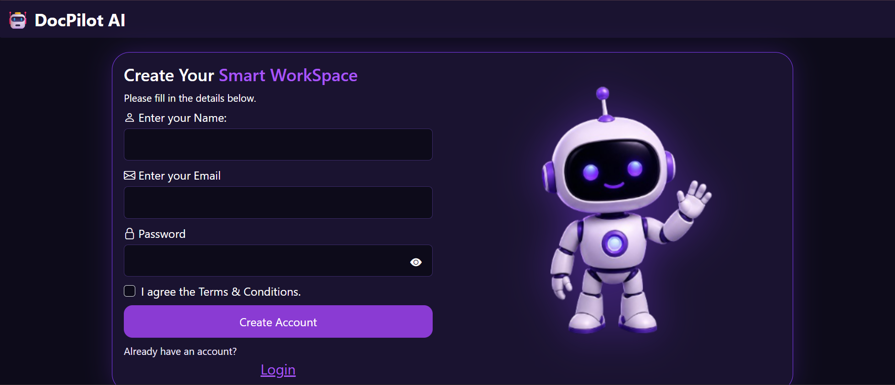
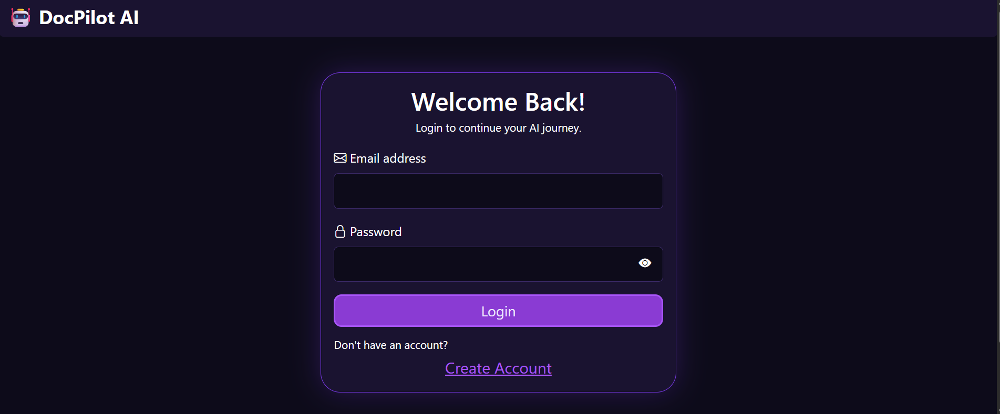
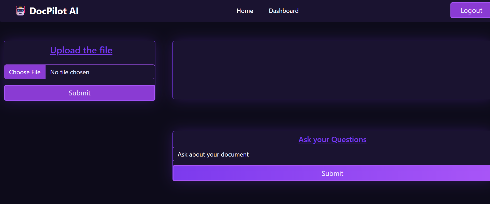

# 🤖 DocPilot AI - Prototype Document Application

## About Project

DocPilot AI is a prototype document application developed using the MERN Stack. It provides a user-friendly platform with secure authentication, subscription plan selection, and a responsive dashboard to manage document-related tasks.

The project focuses on implementing full-stack development concepts including JWT authentication, protected routes, REST APIs, and frontend-backend integration.

## Screenshots

### Registration Page

### Login Page

### Dashboard Page

## Installation and Setup

### Clone Repository

git clone https://github.com/Vaishu-Nagarajan-09/DocPilot-ai.git

### Frontend Setup
- cd frontend

- npm install

- npm run dev

### Backend Setup
- cd backend

- npm install 

- npm run dev

## Environment Variables

Create a `.env` file inside the backend folder:

MONGO_URI=your_mongodb_connection_string

JWT_SECRET=your_secret_key

## Technologies Used:
### Frontend
- React.js
- JavaScript
- Bootstrap
- Axios
### Backend
- Node.js
- Express.js
- MongoDB
- JWT Authentication
### Tools
- Git
- GitHub
- Postman

## Features:
- User Registration & Login
- JWT Authentication
- Protected Routes
- Subscription Plans
- Responsive Dashboard
- REST API Integration
  
## Live Demo
[DocPilot AI](https://docpilot-ai-ass.netlify.app/)

## Author
Vaishnavi N N
